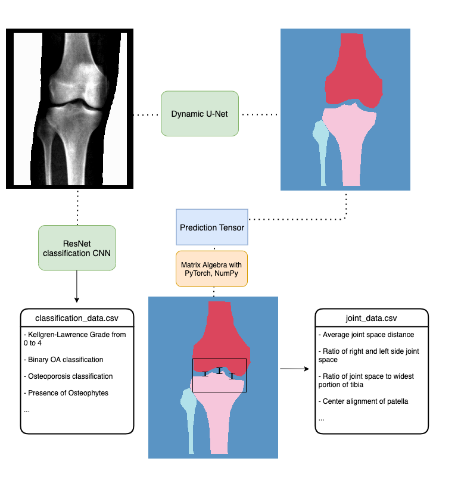

# UKB_knee_segmentation

## Repository for generating measurements from DXA image segmentation: AP knee


usage: runner.py [-h] --path (path to input predictions) --input_filename (name of .txt file listing all files to be processed, .txt in directory specified by --path) --measure (select one of three measures to perform)


```
Required arguments:
  -h, --help            show this help message and exit


  --path PATH           Path to directory with input files


  --input_filename INPUT_FILENAME
                        Path to text file containing list of files from the
                        input directory for processing


  --measure MEASURE     What measurement to run - choices include: jointspace,
                        displacement, or tibiofemoral.


```



